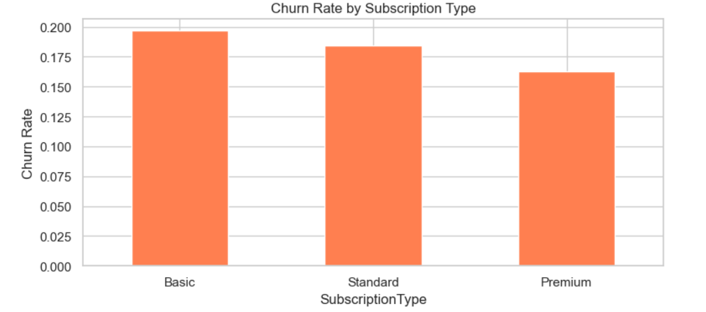
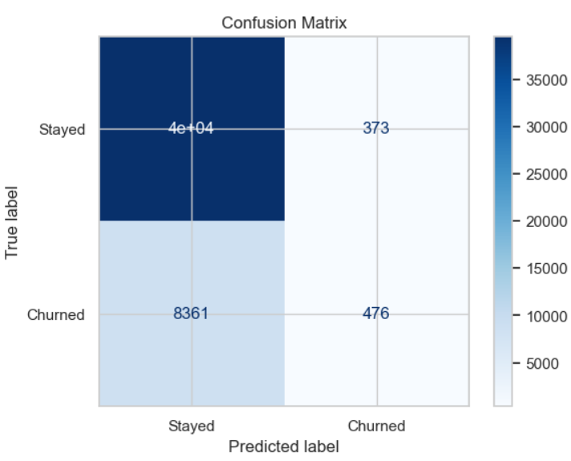
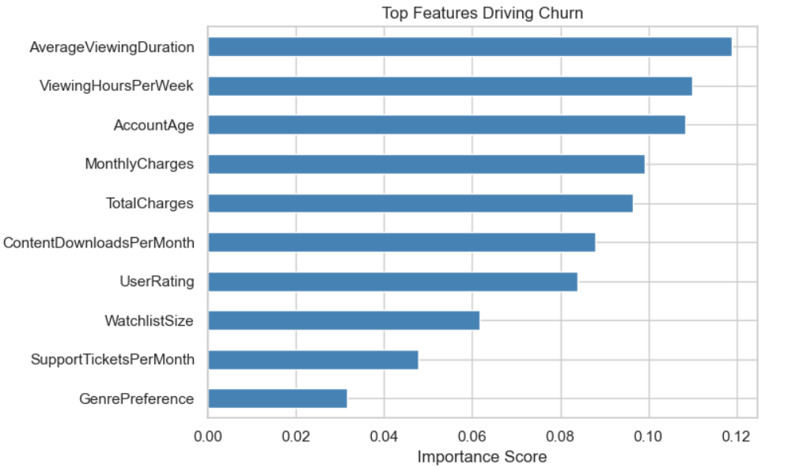
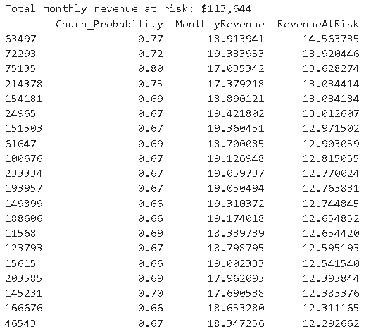

# Customer Churn Prediction

## Overview
This project predicts which customers are likely to leave a subscription-based streaming service. 
Along with predicting churn, it also estimates the monthly revenue at risk so businesses can focus on retaining their most valuable customers.

## Dashboard / Project Screenshots

### Churn Rate by Subscription Type

### Confusion Matrix

### Feature Importance

### Revenue at Risk (Top Customers)

## Dataset
- **Source:** Kaggle - Predictive Analytics for Customer Churn
- **Records:** 243,000+ customers
- **Target:** Churn (1 = Left, 0 = Stayed)
  
## Project Steps
- Explored customer behavior using EDA
- Cleaned and prepared the data
- Encoded categorical features
- Built a Random Forest classification model
- Evaluated the model using Precision, Recall, F1-score, and Confusion Matrix
- Calculated revenue at risk using churn probability
- 
## Key Insights
- Around **18%** of customers churned.
- Basic plan customers had the highest churn rate.
- Customers with lower viewing hours and newer accounts were more likely to leave.
- Revenue at Risk helped identify the customers who should be contacted first.
- 
## Tools Used
- Python
- Pandas
- NumPy
- Matplotlib
- Seaborn
- Scikit-learn
  
## Future Improvements
- Try advanced models like XGBoost or LightGBM.
- Build an interactive dashboard using Power BI or Streamlit.
- Add explainable AI using SHAP values.
- Deploy the model as a web application.
